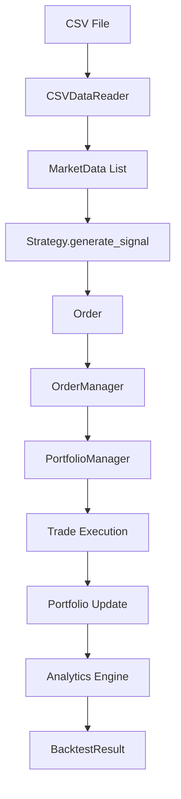

# Design Document

## Overview

The Stock Trading Backtester is a Python-based system designed to simulate trading strategies against historical market data. The architecture follows a modular design with three core components: DataReader for data acquisition, Strategy for trading logic, and Backtester for execution and analysis. This design prioritizes extensibility and future integration with live trading systems.

## Architecture

The system follows a layered architecture pattern with clear separation of concerns:

```
┌─────────────────────────────────────────────────────────────┐
│                    Backtester Engine                        │
│  ┌─────────────────┐  ┌─────────────────┐  ┌─────────────┐ │
│  │   Portfolio     │  │  Order Manager  │  │  Analytics  │ │
│  │   Manager       │  │                 │  │   Engine    │ │
│  └─────────────────┘  └─────────────────┘  └─────────────┘ │
└─────────────────────────────────────────────────────────────┘
                              │
                              ▼
┌─────────────────────────────────────────────────────────────┐
│                    Strategy Layer                           │
│  ┌─────────────────┐  ┌─────────────────┐  ┌─────────────┐ │
│  │  Base Strategy  │  │  Moving Average │  │   Custom    │ │
│  │   Interface     │  │    Strategy     │  │ Strategies  │ │
│  └─────────────────┘  └─────────────────┘  └─────────────┘ │
└─────────────────────────────────────────────────────────────┘
                              │
                              ▼
┌─────────────────────────────────────────────────────────────┐
│                    Data Layer                               │
│  ┌─────────────────┐  ┌─────────────────┐  ┌─────────────┐ │
│  │   CSV Reader    │  │  Data Validator │  │    Market   │ │
│  │                 │  │                 │  │    Data     │ │
│  └─────────────────┘  └─────────────────┘  └─────────────┘ │
└─────────────────────────────────────────────────────────────┘
```

## Components and Interfaces

### 1. Data Layer

#### MarketData Class
```python
@dataclass
class MarketData:
    timestamp: datetime
    open: float
    high: float
    low: float
    close: float
    volume: int
    
    def __post_init__(self):
        # Validation logic for price consistency
        pass
```

#### DataReader Interface
```python
class DataReader(ABC):
    @abstractmethod
    def load_data(self, source: str) -> List[MarketData]:
        pass
    
    @abstractmethod
    def validate_data(self, data: List[MarketData]) -> bool:
        pass

class CSVDataReader(DataReader):
    def __init__(self, date_column: str = 'Date', 
                 open_column: str = 'Open',
                 high_column: str = 'High', 
                 low_column: str = 'Low',
                 close_column: str = 'Close', 
                 volume_column: str = 'Volume'):
        # Column mapping configuration
        pass
```

### 2. Strategy Layer

#### Order Classes
```python
@dataclass
class Order:
    order_type: OrderType  # MARKET, LIMIT
    action: OrderAction    # BUY, SELL
    quantity: int
    price: Optional[float] = None  # None for market orders
    timestamp: datetime = field(default_factory=datetime.now)

@dataclass
class Trade:
    entry_price: float
    exit_price: float
    quantity: int
    entry_time: datetime
    exit_time: datetime
    pnl: float
    order_type: OrderType
```

#### Strategy Interface
```python
class Strategy(ABC):
    def __init__(self, initial_capital: float = 100000):
        self.initial_capital = initial_capital
        self.current_position = 0
        self.cash = initial_capital
        
    @abstractmethod
    def generate_signal(self, current_data: MarketData, 
                       historical_data: List[MarketData]) -> Optional[Order]:
        pass
    
    @abstractmethod
    def get_strategy_name(self) -> str:
        pass

class MovingAverageStrategy(Strategy):
    def __init__(self, short_window: int = 10, long_window: int = 30, 
                 initial_capital: float = 100000):
        super().__init__(initial_capital)
        self.short_window = short_window
        self.long_window = long_window
```

### 3. Backtester Engine

#### Portfolio Manager
```python
class Position:
    def __init__(self, symbol: str, position_id: str, quantity: int = 0, avg_price: float = 0.0):
        self.symbol = symbol
        self.position_id = position_id  # Unique identifier for multiple positions
        self.quantity = quantity
        self.avg_price = avg_price
        self.entry_time = datetime.now()
        self.trades = []
        
    def add_trade(self, trade: Trade) -> Optional[Trade]:
        # Add trade to position and return completed trade if position closed
        pass

class PortfolioManager:
    def __init__(self, initial_capital: float):
        self.initial_capital = initial_capital
        self.cash = initial_capital
        self.positions = {}  # position_id -> Position (supports multiple positions)
        self.portfolio_history = []
        self.max_positions = 5  # Maximum concurrent positions
        
    def execute_order(self, order: Order, current_price: float) -> Optional[Trade]:
        # Order execution logic with multiple position support
        pass
    
    def get_portfolio_value(self, current_prices: Dict[str, float]) -> float:
        # Calculate total portfolio value across all positions
        pass
    
    def get_available_position_slots(self) -> int:
        # Return number of available position slots
        pass
```

#### Order Manager
```python
class OrderManager:
    def __init__(self):
        self.pending_orders = []
        self.executed_trades = []
        
    def add_order(self, order: Order):
        pass
    
    def process_orders(self, current_data: MarketData) -> List[Trade]:
        # Process pending limit orders against current market data
        pass
```

#### Analytics Engine
```python
class AnalyticsEngine:
    @staticmethod
    def calculate_profit_factor(trades: List[Trade]) -> float:
        gross_profit = sum(trade.pnl for trade in trades if trade.pnl > 0)
        gross_loss = abs(sum(trade.pnl for trade in trades if trade.pnl < 0))
        return gross_profit / gross_loss if gross_loss > 0 else float('inf')
    
    @staticmethod
    def calculate_sharpe_ratio(returns: List[float], risk_free_rate: float = 0.02) -> float:
        # Sharpe ratio calculation
        pass
    
    @staticmethod
    def calculate_max_drawdown(portfolio_values: List[float]) -> float:
        # Maximum drawdown calculation
        pass

#### Visualization Engine
```python
class VisualizationEngine:
    def __init__(self):
        self.fig_size = (12, 8)
        self.colors = {
            'entry_signal': '#808080',     # Gray for entry signals
            'exit_profit': '#00ff00',      # Green for profitable exits
            'exit_loss': '#ff0000',        # Red for loss exits
            'price_line': '#1f77b4',      # Blue for price line
            'connection_line': '#666666'   # Gray for connection lines
        }
        
    def plot_price_with_signals(self, market_data: List[MarketData], 
                               trades: List[Trade], 
                               save_path: Optional[str] = None) -> None:
        # Create price chart with enhanced entry/exit visualization:
        # - Buy Entry: Upward gray triangle (^)
        # - Buy Exit (Profit): Downward green triangle (v)
        # - Buy Exit (Loss): Downward red triangle (v)
        # - Sell Entry: Downward gray triangle (v)
        # - Sell Exit (Profit): Upward green triangle (^)
        # - Sell Exit (Loss): Upward red triangle (^)
        # - Dotted lines connecting entry and exit points
        pass
    
    def plot_equity_curve(self, portfolio_values: List[float], 
                         timestamps: List[datetime],
                         save_path: Optional[str] = None) -> None:
        # Create equity curve visualization
        pass
    
    def plot_drawdown(self, portfolio_values: List[float], 
                     timestamps: List[datetime],
                     save_path: Optional[str] = None) -> None:
        # Create drawdown visualization
        pass
    
    def create_performance_dashboard(self, backtest_result: 'BacktestResult',
                                   market_data: List[MarketData],
                                   save_path: Optional[str] = None) -> None:
        # Create comprehensive dashboard with multiple charts
        pass
```

#### Result Management
```python
class ResultManager:
    def __init__(self, base_dir: str = "test_results"):
        self.base_dir = base_dir
        self._ensure_directory_exists()
    
    def _ensure_directory_exists(self) -> None:
        # Create test_results directory if it doesn't exist
        pass
    
    def save_backtest_results(self, results: 'BacktestResult', 
                             strategy_name: str) -> str:
        # Save JSON results to test_results folder with timestamp
        pass
    
    def save_trade_history(self, trades: List[Trade], 
                          strategy_name: str) -> str:
        # Save CSV trade history to test_results folder with timestamp
        pass
    
    def get_results_path(self, filename: str) -> str:
        # Generate full path for results file
        pass
```

## Data Models

### Core Data Structures

1. **MarketData**: Represents a single candlestick with OHLCV data
2. **Order**: Represents a trading order with type, action, and parameters
3. **Trade**: Represents a completed trade with entry/exit details and P&L
4. **BacktestResult**: Comprehensive results container with all performance metrics

### Data Flow



## Error Handling

### Data Validation Errors
- **Invalid CSV Format**: Graceful handling with descriptive error messages
- **Missing Required Columns**: Clear indication of which columns are missing
- **Invalid Price Data**: Detection of negative prices or high > low violations
- **Date Parsing Errors**: Robust date format detection and conversion

### Strategy Execution Errors
- **Insufficient Capital**: Order rejection with balance checking
- **Invalid Order Parameters**: Validation of order quantities and prices
- **Strategy Calculation Errors**: Exception handling in signal generation

### System-Level Error Handling
- **File I/O Errors**: Proper exception handling for file operations
- **Memory Management**: Efficient handling of large datasets
- **Graceful Degradation**: System continues operation when non-critical errors occur

## Testing Strategy

### Unit Testing
- **Data Reader Tests**: CSV parsing, validation, error handling
- **Strategy Tests**: Signal generation, order creation, edge cases
- **Portfolio Manager Tests**: Order execution, position tracking, balance management
- **Analytics Tests**: Metric calculations, edge cases (no trades, all losses, etc.)

### Integration Testing
- **End-to-End Backtests**: Complete workflow from CSV to results
- **Strategy Integration**: Multiple strategies with same data
- **Data Pipeline Testing**: Various CSV formats and data quality scenarios

### Performance Testing
- **Large Dataset Handling**: Multi-year daily data processing
- **Memory Usage**: Efficient data structure usage
- **Execution Speed**: Backtesting performance benchmarks

### Validation Testing
- **Known Strategy Results**: Validate against manually calculated results
- **Market Data Integrity**: Ensure data consistency throughout processing
- **Financial Calculations**: Verify accuracy of profit factor, Sharpe ratio, etc.

## Visualization Marker Specifications

### Entry/Exit Signal Markers
The visualization engine must display trading signals with specific marker colors and shapes:

#### Buy Signals
- **Buy Entry**: Upward gray triangle (^) - Color: #808080
- **Buy Exit (Profit)**: Downward green triangle (v) - Color: #00ff00  
- **Buy Exit (Loss)**: Downward red triangle (v) - Color: #ff0000

#### Sell Signals
- **Sell Entry**: Downward gray triangle (v) - Color: #808080
- **Sell Exit (Profit)**: Upward green triangle (^) - Color: #00ff00
- **Sell Exit (Loss)**: Upward red triangle (^) - Color: #ff0000

#### Connection Lines
- Entry and exit points should be connected with dotted gray lines - Color: #666666

## Technical Indicator Requirements

### RSI Calculation
RSI (Relative Strength Index) calculations must use the TA-Lib library for accuracy and consistency:

#### Dependencies
- Install TA-Lib: `python -m pip install TA-Lib`
- Use `talib.RSI()` function instead of custom implementations

#### RSI Strategy Implementation
```python
import talib

def _calculate_rsi(self, data: List[MarketData]) -> Optional[float]:
    """Calculate RSI using TA-Lib for accuracy."""
    if len(data) < self.rsi_period + 1:
        return None
    
    # Extract closing prices
    close_prices = np.array([d.close for d in data])
    
    # Calculate RSI using TA-Lib
    rsi_values = talib.RSI(close_prices, timeperiod=self.rsi_period)
    
    # Return the most recent RSI value
    return rsi_values[-1] if not np.isnan(rsi_values[-1]) else None
```

## Implementation Considerations

### Performance Optimizations
- Use pandas for efficient data manipulation where appropriate
- Implement lazy loading for large datasets
- Optimize hot paths in order execution and signal generation

### Extensibility Points
- Plugin architecture for new data sources (API, database)
- Strategy factory pattern for easy strategy registration
- Configurable analytics metrics and reporting formats

### Future Live Trading Integration
- Abstract interfaces that match common trading API patterns
- Realistic execution assumptions (slippage, fees, latency)
- Order management system compatible with broker APIs
- Risk management hooks for position sizing and stop losses